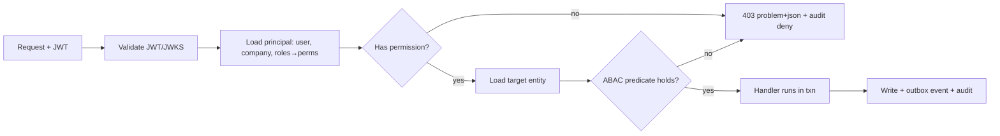

# Fastflow — API Specification & RBAC

REST over HTTPS (JSON). A typed BFF (tRPC/GraphQL optional) sits in front for the Next.js app;
external/partner integrations use the versioned REST API below. Contract is **OpenAPI 3.1**,
generated from NestJS decorators and published to `/docs`.

## 1. Conventions

- **Base:** `https://api.fastflow.global/v1` (URL-versioned; breaking changes → `/v2`).
- **AuthN:** `Authorization: Bearer <JWT>` from Clerk/Auth0; validated against JWKS. Service-to-service uses short-lived mTLS or signed service tokens.
- **AuthZ:** every endpoint declares a required permission (`<resource>:<action>`); see §3.
- **Tenancy/scoping:** the principal's `companyId` is derived from the token, **never** from the request body. Row-level filters are applied server-side (the prototype's critical bug was trusting a client-supplied company string — forbidden here).
- **Idempotency:** all `POST`/`PATCH` that cause side effects require `Idempotency-Key: <ulid>`.
- **Pagination:** cursor-based — `?limit=50&cursor=<opaque>`; responses include `nextCursor`.
- **Filtering/sort:** explicit allowlisted fields only (no arbitrary query → SQL).
- **Errors:** RFC 9457 `application/problem+json`:
  ```json
  { "type":"https://errors.fastflow.global/forbidden","title":"Forbidden",
    "status":403,"detail":"Missing permission order:release_escrow","traceId":"..." }
  ```
- **Rate limits:** per-principal + per-IP token buckets (Redis); `429` with `Retry-After`.
- **Versioned events**, **traceId** echoed in every response header (`X-Trace-Id`).

## 2. Representative endpoints (by context)

### Identity & company
| Method | Path | Permission | Notes |
|--------|------|-----------|-------|
| `POST` | `/companies` | `company:create` | creates company + admin membership |
| `GET`  | `/companies/{id}` | `company:read` | scoped: own company or public profile fields |
| `POST` | `/companies/{id}/kyb` | `kyb:submit` | starts/updates KYB case, attaches docs |
| `POST` | `/companies/{id}/users/invite` | `user:invite` | role-scoped invite |
| `POST` | `/users/me/mfa` | `self` | enroll TOTP/WebAuthn |

### Catalog
| `POST` | `/products` | `product:create` | manufacturer + tier≥VERIFIED only; enters `IN_REVIEW` |
| `PATCH`| `/products/{id}` | `product:update` | owner manufacturer only; bumps `version` |
| `POST` | `/products/{id}/publish` | `product:publish` | emits `product.published` → indexer |
| `GET`  | `/search/products` | public | hits OpenSearch; locale + facets |

### Sourcing & orders
| `POST` | `/rfqs` | `rfq:create` | trader only |
| `POST` | `/rfqs/{id}/quotes` | `quote:create` | manufacturer only; one per supplier per RFQ |
| `POST` | `/quotes/{id}/accept` | `quote:accept` | trader (RFQ owner); creates `Order` (idempotent) |
| `GET`  | `/orders` | `order:read` | row-scoped to buyer or seller company |
| `POST` | `/orders/{id}/escrow/fund` | `order:fund` | buyer; creates Stripe/Airwallex intent |
| `POST` | `/orders/{id}/escrow/release` | `order:release_escrow` | buyer **or** auto on inspection-pass + timer; blocked if dispute frozen |

### Trust subsystems
| `POST` | `/orders/{id}/inspections` | `inspection:request` | buyer/seller; schedules 3rd-party QC |
| `POST` | `/orders/{id}/disputes` | `dispute:open` | freezes escrow; opens case |
| `POST` | `/orders/{id}/reviews` | `review:create` | only after `COMPLETED`; one per side |
| `POST` | `/documents` | `document:upload` | returns S3 **pre-signed PUT**; AV scan async |
| `GET`  | `/documents/{id}/download` | `document:read` | authorize → time-boxed signed GET; **audited** |
| `GET`  | `/conversations/{id}/messages` | `message:read` | participants only |

### Admin / ops
| `GET` | `/admin/audit` | `audit:read` | platform admin; filter by entity/actor |
| `POST`| `/admin/kyb/{caseId}/decide` | `kyb:decide` | approve/reject; emits event; logged |
| `POST`| `/admin/disputes/{id}/resolve` | `dispute:resolve` | splits/releases escrow per decision |

## 3. RBAC + ABAC model

**Roles (coarse) × Permissions (fine).** A user has roles; roles grant permissions; **ABAC predicates** add row-level constraints evaluated at the data layer.

| Role | Representative permissions |
|------|---------------------------|
| `PLATFORM_ADMIN` | `*` (every `admin:*`, `kyb:decide`, `dispute:resolve`, `audit:read`) |
| `PLATFORM_OPS` | `kyb:decide`, `dispute:resolve`, `inspection:*`, `audit:read` (no payouts) |
| `COMPANY_ADMIN` | `company:*` (own), `user:invite`, `kyb:submit` |
| `PURCHASER` (trader) | `rfq:create`, `quote:accept`, `order:fund`, `order:release_escrow`, `dispute:open`, `review:create` |
| `SALES` (manufacturer) | `product:*` (own), `quote:create`, `order:read` (as seller) |
| `FINANCE` | `order:read`, `payment:read`, `order:release_escrow` |
| `VIEWER` | `*:read` within company |

**ABAC predicates (enforced server-side, never client-trusted):**
- `order:read` ⇒ `order.buyerCompanyId == principal.companyId OR order.sellerCompanyId == principal.companyId OR principal.isPlatformAdmin`
- `product:update` ⇒ `product.manufacturer.companyId == principal.companyId`
- `message:read` ⇒ `principal.userId ∈ conversation.participants`
- `order:release_escrow` ⇒ buyer side **and** `escrow.frozen == false` **and** order not `DISPUTED`
- Tier gate: `product:publish` / `quote:create` require `company.tier >= VERIFIED`; high-value orders require `PREMIUM`.

**Implementation:** a Nest `@RequirePermission('order:release_escrow')` guard checks role grants; a second **policy layer** (`CASL` ability or OPA/Rego for complex cases) evaluates the ABAC predicate against the loaded entity *before* the handler runs. Deny by default.

## 4. Authorization decision flow



Every **deny** is itself an audit event (security signal feeding Fraud).

Continue to `SECURITY.md`.
