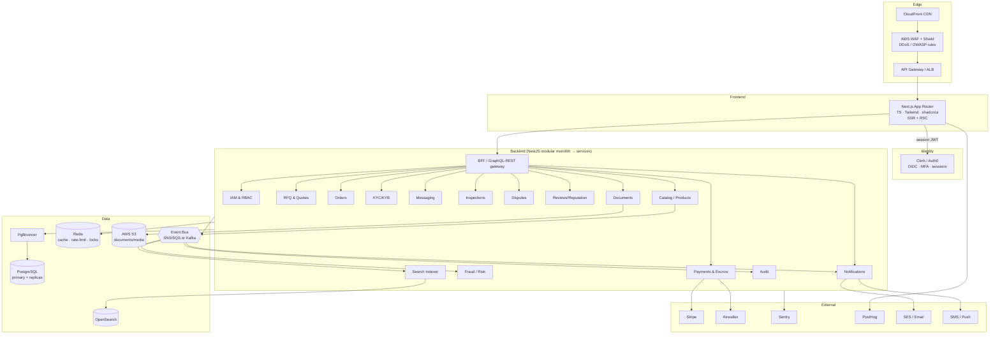

# SinoSource — Production Architecture (Blueprint)

> Author role: Principal / Security Architect & CTO.
> Status: **Design blueprint.** The current repo (`main.py` + `index.html` + `app.js`) is a
> **prototype** and is *replaced*, not extended, by this design. This document set is the
> source of truth that the production build is derived from.

## Document map

| File | Contents |
|------|----------|
| `ARCHITECTURE.md` (this file) | System architecture, service decomposition, event-driven backbone, deployment topology, scalability, risks & tradeoffs |
| `DATA-MODEL.md` | ERD + complete Prisma schema for all 18 entities, indexes, constraints, partitioning/scaling |
| `API.md` | API conventions, authn/z, pagination, errors, RBAC matrix, representative endpoints |
| `SECURITY.md` | OWASP Top 10 mitigations, MFA, sessions, encryption, rate limiting, DDoS, secure uploads, secrets, audit |
| `SUBSYSTEMS.md` | The 17 required subsystems, each in the 7-part output format (business, system design, DB, API, security, scalability, example) |

---

## 1. Goals → architectural drivers

| Goal | Primary architectural consequence |
|------|-----------------------------------|
| Trust-first marketplace | KYC/KYB + verification + escrow + reputation are *first-class domains*, not add-ons |
| Enterprise-grade security | Zero-trust between services, encryption everywhere, signed audit log, least-privilege RBAC/ABAC |
| Millions of users | Stateless services, horizontal scale, connection pooling (PgBouncer), read replicas, caching |
| Millions of products | Catalog write store (Postgres) **separate** from read/search store (OpenSearch); CQRS read models |
| Multi-language | Content translation tables + per-request locale; i18n at the edge; search analyzers per language |
| Multi-currency | Money stored as integer **minor units + ISO-4217 currency**; FX snapshots; never float |
| Compliance-ready | Data residency boundaries, retention policies, right-to-erasure, exportable audit trail |
| Auditability | Append-only, hash-chained `AuditLog`; every state transition emits a domain event |

These drivers explain every non-obvious choice below. When a tradeoff is made, it is made in service of one of these rows.

---

## 2. High-level system architecture



### 2.1 Service decomposition strategy — modular monolith first

**Decision:** Start as a **NestJS modular monolith** with hard module boundaries (one Nest module per bounded context, no cross-module DB access, communication via in-process command/query bus + domain events). Extract to independent services **only** when a module has a divergent scaling profile.

**Why (tradeoff):**
- A 4–8 person team shipping a trust marketplace does **not** benefit from day-one microservices: distributed transactions, network failure modes, and ops overhead would dominate.
- Module boundaries (enforced by lint rules + per-module Prisma client scoping) give us the *option* to extract later at low cost.
- **First extraction candidates** (different scaling/compliance profile): `Search Indexer` (CPU/IO bound), `Payments/Escrow` (PCI/regulatory isolation), `Messaging` (websocket fan-out), `Fraud` (ML workloads).

### 2.2 Bounded contexts

| Context | Owns | Key invariants |
|---------|------|----------------|
| IAM | users, sessions, roles, permissions, MFA | a principal's effective permissions; no privilege escalation |
| Company/KYC | companies, manufacturers, traders, factories, KYB cases, certifications | a company cannot transact above its verification tier |
| Catalog | products, categories, media, translations | only verified manufacturers list; price/MOQ integrity |
| Sourcing | RFQs, quotes | quote belongs to exactly one RFQ + one manufacturer |
| Orders | orders, order lines, milestones | order derives from an accepted quote |
| Payments | payments, escrow accounts, ledger, payouts | double-entry ledger always balances; escrow funds segregated |
| Messaging | conversations, messages, attachments | participants-only access; immutable history |
| Documents | documents, versions, access grants | every download authorized + audited |
| Inspections | inspection orders, reports, findings | report tied to an order milestone |
| Disputes | disputes, evidence, resolutions | dispute freezes the relevant escrow release |
| Reviews | reviews, reputation scores | review only after a completed order (verified transaction) |
| Risk/Fraud | signals, rules, cases, decisions | risk decision is auditable + explainable |
| Notifications | templates, deliveries, preferences | idempotent delivery; respects user prefs/locale |
| Audit | append-only hash-chained log | tamper-evident; never deleted, only archived |

---

## 3. Event-driven backbone

### 3.1 Pattern: Transactional Outbox + CDC-free reliable publish

Every state change is written **in the same Postgres transaction** as an `outbox_events` row. A relay (Debezium-style poller or a NestJS scheduled dispatcher with `FOR UPDATE SKIP LOCKED`) publishes outbox rows to the bus and marks them sent. This guarantees **at-least-once** delivery with **no dual-write inconsistency**.

```
BEGIN;
  UPDATE orders SET status='paid' WHERE id=...;
  INSERT INTO outbox_events(aggregate, type, payload, ...) VALUES ('order','order.paid', ...);
COMMIT;
-- relay: SELECT ... FROM outbox_events WHERE published_at IS NULL FOR UPDATE SKIP LOCKED → publish → mark
```

Consumers are **idempotent** (dedupe on `event_id`) because delivery is at-least-once.

### 3.2 Canonical events (envelope is versioned)

```jsonc
{
  "id": "evt_01H...",            // ULID, idempotency key
  "type": "order.paid",          // <aggregate>.<past-tense>
  "version": 1,
  "occurredAt": "2026-06-12T...Z",
  "actor": { "type": "user|system|service", "id": "..." },
  "tenant": "global|cn|eu",      // data residency routing
  "aggregate": { "type": "order", "id": "ord_..." },
  "data": { /* context-specific, backward-compatible */ },
  "trace": { "traceId": "...", "spanId": "..." }
}
```

Representative event catalog: `user.registered`, `company.kyb_verified`, `product.published`, `rfq.created`, `quote.submitted`, `order.created`, `payment.escrow_funded`, `payment.released`, `inspection.passed`, `dispute.opened`, `dispute.resolved`, `review.posted`, `risk.flagged`.

### 3.3 Why event-driven (and the tradeoff)

- **Decouples** write path from search indexing, notifications, fraud scoring, audit, analytics — each scales independently and a slow consumer never blocks a checkout.
- **Tradeoff:** eventual consistency in read models (search may lag the catalog by seconds). Acceptable for discovery; **never** used for money or authorization (those read the primary, strongly consistent).
- **Bus choice:** start with **SNS→SQS** (managed, cheap, ordered-enough with FIFO per aggregate). Migrate hot streams (messaging, fraud) to **Kafka** when ordered high-throughput replay is needed.

---

## 4. Deployment & infrastructure topology

| Concern | Choice | Notes |
|--------|--------|-------|
| Compute | ECS Fargate or EKS | start Fargate; EKS when bin-packing/cost demands |
| Ingress | CloudFront → WAF/Shield → ALB | TLS termination at ALB, mTLS optional service mesh |
| DB | Aurora PostgreSQL (writer + ≥2 readers) | PgBouncer in transaction mode; failover < 30s |
| Cache/locks | ElastiCache Redis (cluster mode) | cache, rate-limit counters, distributed locks (Redlock) |
| Search | OpenSearch managed, 3 data + 3 master nodes | per-locale indices, blue/green reindex |
| Object store | S3 + KMS SSE-KMS | versioning on, Object Lock for legal-hold docs |
| Bus | SNS/SQS (+ Kafka later) | DLQs on every consumer |
| Secrets | AWS Secrets Manager + IRSA | no secrets in env files or images |
| CI/CD | GitHub Actions → ECR → ECS blue/green | DB migrations gated, run via job not app boot |
| IaC | Terraform | environments: dev / staging / prod, per-region |
| Observability | Sentry (errors), PostHog (product), OTel→CloudWatch/Grafana (traces/metrics/logs) | trace IDs propagated end-to-end |

**Multi-region / data residency:** China-origin manufacturer PII and KYB documents may be subject to data-localization. Design supports a **per-tenant region pin** (`tenant` in the event envelope and a `region` column on PII-bearing tables) so EU/CN data can be hosted in-region while the global catalog read model is replicated. This is a *future* path; v1 ships single-region with the schema seams in place.

---

## 5. Scalability path (staged)

| Stage | Users | What changes |
|------|-------|--------------|
| 0 — MVP | <10k | Modular monolith, single Aurora writer + 1 reader, OpenSearch single index, SNS/SQS |
| 1 — Growth | 10k–500k | Add read replicas + PgBouncer; Redis caching of catalog/profile; per-locale search indices; CDN for media |
| 2 — Scale | 0.5M–5M | Extract Search Indexer, Payments, Messaging to services; partition hot tables (messages, audit_logs, notifications, outbox) by time; Kafka for messaging/fraud |
| 3 — Hyperscale | >5M | Shard by `company_id`/`tenant` (Citus or app-level); regional active-active read models; dedicated analytics lake (S3 + Athena/Redshift) |

**Hot-table strategy** (detail in `DATA-MODEL.md`): `audit_logs`, `messages`, `notifications`, `outbox_events`, `fraud_signals` are **append-heavy** → declarative **range partitioning by month**, automated partition creation, and archival of cold partitions to S3/Glacier.

---

## 6. Cross-cutting concerns

- **AuthN:** Clerk/Auth0 issues OIDC tokens; NestJS validates JWT (JWKS) on every request; **no session state in services** (stateless). Session/MFA lifecycle owned by the IdP.
- **AuthZ:** central **RBAC + ABAC** policy module (`API.md` §RBAC). Every endpoint declares required permission; row-level scoping (e.g. "supplier sees only their RFQs") enforced in the data layer, mirroring the lesson from the prototype where company-string auth was the critical bug.
- **Idempotency:** all mutating public endpoints accept an `Idempotency-Key`; stored in Redis + Postgres for 24h.
- **Money:** `amount BIGINT` (minor units) + `currency CHAR(3)`; FX via snapshotted rates; double-entry ledger. **No floats anywhere.**
- **Multi-language:** translatable content in side tables keyed by `(entity_id, locale)`; UI strings via i18n bundles; OpenSearch per-language analyzers.
- **Observability:** OpenTelemetry traces across BFF→service→DB; Sentry for exceptions with release health; PostHog for funnels (RFQ→quote→order conversion).

---

## 7. Top risks & tradeoffs (CTO view)

| Risk | Impact | Mitigation |
|------|--------|------------|
| Escrow/payments regulatory scope (money transmission, PCI) | Legal/financial | Use Stripe/Airwallex as **regulated processor of record**; we never hold raw card data; segregated escrow via provider; isolate Payments service early |
| KYC/KYB false accept → fraud on platform | Trust collapse | Tiered verification, vendor (e.g. sanctions/UBO) checks, manual review queue, transaction limits gated by tier |
| Eventual consistency misused for authz/money | Security/financial bug | Hard rule: authz + money read the **primary**; only discovery/analytics read replicas/search |
| Search/catalog divergence | Buyer sees stale/incorrect listings | Outbox-driven indexing + periodic reconcile job + version stamps |
| Multi-currency rounding/FX drift | Ledger imbalance | Integer minor units, banker's rounding at defined points, FX snapshot per transaction, daily ledger reconciliation |
| Data residency (CN/EU) | Compliance | Region-pin seams in schema/events now; defer full multi-region to Stage 2 |
| Premature microservices | Velocity death | Modular monolith with enforced boundaries; extract on evidence, not aspiration |
| Vendor lock-in (Clerk/Stripe/Airwallex/OpenSearch) | Strategic | Wrap each behind an internal port/adapter interface; keep domain logic provider-agnostic |

---

## 8. What the existing prototype contributes

Not wasted — it validated the **domain model** (users, products, RFQs, quotes, orders, messages, verifications, audit) and surfaced the **exact security failure mode** this design must prevent: *authorization by mutable identifier instead of a stable identity link*. That lesson is encoded in the RBAC/row-scoping rules (`API.md`) and the `AuditLog` design (`SUBSYSTEMS.md` §6).

Continue to `DATA-MODEL.md`.
