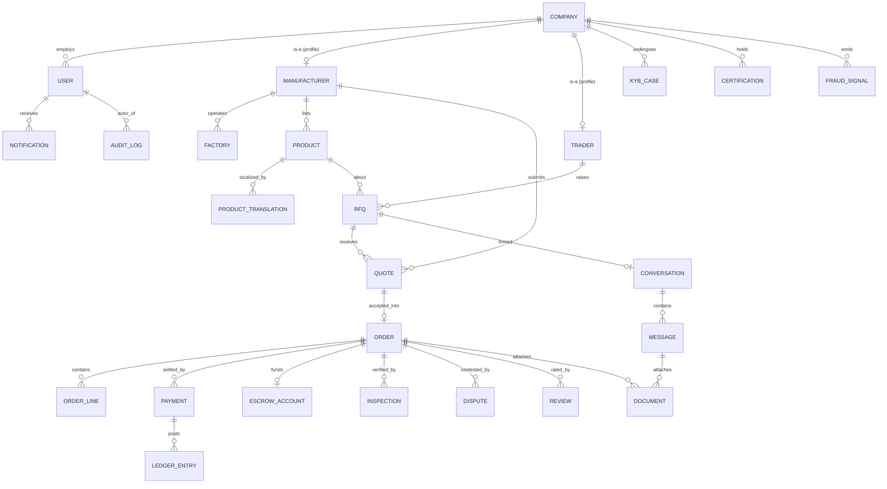

# Fastflow — Data Model (ERD + Prisma Schema)

Covers the 18 required entities plus the supporting tables they require to be production-real
(sessions, MFA, roles/permissions, escrow ledger, outbox, translations, KYB cases, fraud signals).

Conventions:
- **IDs**: ULID (`@id @default(...)` via app-generated ULID) — sortable, non-enumerable, index-friendly.
- **Timestamps**: `createdAt`/`updatedAt` on every table; soft delete via `deletedAt` where retention requires it.
- **Money**: `BigInt` minor units + `currency Char(3)`. Never `Float`/`Decimal` for money movement (Decimal only for FX rates).
- **Multi-tenant/residency**: `region` on PII-bearing tables; most tables also carry `companyId` for row-scoping.
- **Indexes**: every FK is indexed; composite indexes match real query/sort patterns; partial/unique indexes called out.

---

## 1. ERD (core relationships)



---

## 2. Prisma schema

> Single logical schema; in a modular monolith each Nest module is granted access only to its
> own tables via a scoped Prisma client + lint boundary. Cross-context references use IDs, not joins
> across module boundaries (the DB enforces FKs; application code respects ownership).

```prisma
// ---------- Enums ----------
enum CompanyType        { MANUFACTURER TRADER BOTH }
enum VerificationTier   { UNVERIFIED BASIC VERIFIED PREMIUM }   // gates transaction limits
enum KybStatus          { NOT_STARTED IN_REVIEW INFO_REQUESTED APPROVED REJECTED EXPIRED }
enum UserStatus         { ACTIVE SUSPENDED INVITED DISABLED }
enum ProductStatus      { DRAFT IN_REVIEW PUBLISHED ARCHIVED REJECTED }
enum RfqStatus          { OPEN QUOTING AWARDED CLOSED CANCELLED }
enum QuoteStatus        { DRAFT SUBMITTED SHORTLISTED ACCEPTED REJECTED EXPIRED }
enum OrderStatus        { CREATED AWAITING_PAYMENT IN_ESCROW IN_PRODUCTION READY_FOR_INSPECTION SHIPPED DELIVERED COMPLETED CANCELLED DISPUTED }
enum PaymentStatus      { REQUIRES_ACTION PROCESSING SUCCEEDED FAILED REFUNDED PARTIALLY_REFUNDED }
enum PaymentKind        { ESCROW_FUNDING ESCROW_RELEASE REFUND PAYOUT PLATFORM_FEE }
enum LedgerDirection    { DEBIT CREDIT }
enum InspectionStatus   { REQUESTED SCHEDULED IN_PROGRESS PASSED FAILED CANCELLED }
enum DisputeStatus      { OPEN UNDER_REVIEW AWAITING_EVIDENCE RESOLVED_BUYER RESOLVED_SELLER RESOLVED_SPLIT WITHDRAWN }
enum DocumentKind       { BUSINESS_LICENSE CERTIFICATE PROFORMA_INVOICE PACKING_LIST CONTRACT INSPECTION_REPORT KYC_ID OTHER }
enum NotificationChannel{ EMAIL SMS PUSH IN_APP }
enum RiskDecision       { ALLOW REVIEW DENY }
enum Region             { GLOBAL CN EU US }

// ---------- IAM ----------
model User {
  id            String     @id
  clerkId       String     @unique                 // external IdP subject
  email         String     @unique
  emailVerified Boolean    @default(false)
  fullName      String
  phone         String?
  locale        String     @default("en")
  status        UserStatus @default(INVITED)
  companyId     String?
  company       Company?   @relation(fields: [companyId], references: [id])
  roles         UserRole[]
  mfaFactors    MfaFactor[]
  sessions      Session[]
  notifications Notification[]
  region        Region     @default(GLOBAL)
  lastSeenAt    DateTime?
  createdAt     DateTime   @default(now())
  updatedAt     DateTime   @updatedAt
  deletedAt     DateTime?

  @@index([companyId])
  @@index([status])
}

model Role {                                        // e.g. COMPANY_ADMIN, PURCHASER, SALES, OPS, PLATFORM_ADMIN
  id          String           @id
  key         String           @unique
  description String
  permissions RolePermission[]
  users       UserRole[]
}

model Permission {                                  // e.g. product:create, order:release_escrow
  id    String           @id
  key   String           @unique                    // "<resource>:<action>"
  roles RolePermission[]
}

model RolePermission {
  roleId       String
  permissionId String
  role         Role       @relation(fields: [roleId], references: [id], onDelete: Cascade)
  permission   Permission @relation(fields: [permissionId], references: [id], onDelete: Cascade)
  @@id([roleId, permissionId])
}

model UserRole {
  userId    String
  roleId    String
  companyId String?                                  // role can be scoped to a company context
  user      User   @relation(fields: [userId], references: [id], onDelete: Cascade)
  role      Role   @relation(fields: [roleId], references: [id], onDelete: Cascade)
  @@id([userId, roleId])
  @@index([roleId])
}

model MfaFactor {
  id        String   @id
  userId    String
  type      String                                   // TOTP | WEBAUTHN | SMS
  secretRef String                                   // pointer to Secrets Manager, never the secret
  verified  Boolean  @default(false)
  user      User     @relation(fields: [userId], references: [id], onDelete: Cascade)
  createdAt DateTime @default(now())
  @@index([userId])
}

model Session {                                      // mirror of IdP session for audit/revocation
  id         String   @id
  userId     String
  ip         String?
  userAgent  String?
  createdAt  DateTime @default(now())
  expiresAt  DateTime
  revokedAt  DateTime?
  user       User     @relation(fields: [userId], references: [id], onDelete: Cascade)
  @@index([userId])
  @@index([expiresAt])
}

// ---------- Company / KYC-KYB ----------
model Company {
  id               String           @id
  legalName        String
  displayName      String
  type             CompanyType
  country          String                            // ISO-3166
  region           Region           @default(GLOBAL)
  tier             VerificationTier @default(UNVERIFIED)
  kybStatus        KybStatus        @default(NOT_STARTED)
  taxId            String?
  registrationNo   String?
  website          String?
  users            User[]
  manufacturer     Manufacturer?
  trader           Trader?
  kybCases         KybCase[]
  certifications   Certification[]
  documents        Document[]
  fraudSignals     FraudSignal[]
  createdAt        DateTime         @default(now())
  updatedAt        DateTime         @updatedAt
  deletedAt        DateTime?

  @@unique([country, registrationNo])
  @@index([type, tier])
  @@index([kybStatus])
}

model Manufacturer {
  id            String    @id
  companyId     String    @unique
  company       Company   @relation(fields: [companyId], references: [id], onDelete: Cascade)
  yearFounded   Int?
  employeeCount Int?
  factories     Factory[]
  products      Product[]
  quotes        Quote[]
  ratingAvg     Decimal   @default(0) @db.Decimal(3,2)   // denormalized reputation (read model)
  ratingCount   Int       @default(0)
}

model Trader {
  id        String  @id
  companyId String  @unique
  company   Company @relation(fields: [companyId], references: [id], onDelete: Cascade)
  rfqs      Rfq[]
}

model Factory {
  id             String       @id
  manufacturerId String
  manufacturer   Manufacturer @relation(fields: [manufacturerId], references: [id], onDelete: Cascade)
  name           String
  address        String
  country        String
  capacityNote   String?
  inspections    Inspection[]
  createdAt      DateTime     @default(now())
  @@index([manufacturerId])
}

model KybCase {
  id          String    @id
  companyId   String
  company     Company   @relation(fields: [companyId], references: [id], onDelete: Cascade)
  status      KybStatus @default(IN_REVIEW)
  provider    String?                                 // external KYB vendor
  providerRef String?
  riskScore   Int?                                    // 0..100
  reviewerId  String?                                 // platform admin user id
  decidedAt   DateTime?
  notes       String?
  documents   Document[]
  createdAt   DateTime  @default(now())
  updatedAt   DateTime  @updatedAt
  @@index([companyId, status])
}

model Certification {
  id          String   @id
  companyId   String
  company     Company  @relation(fields: [companyId], references: [id], onDelete: Cascade)
  kind        String                                  // ISO9001, CE, RoHS, BSCI...
  issuer      String
  number      String
  validFrom   DateTime?
  validTo     DateTime?
  documentId  String?
  verified    Boolean  @default(false)
  @@index([companyId])
  @@index([kind])
}

// ---------- Catalog ----------
model Product {
  id             String              @id
  manufacturerId String
  manufacturer   Manufacturer        @relation(fields: [manufacturerId], references: [id])
  categoryId     String
  category       Category            @relation(fields: [categoryId], references: [id])
  sku            String?
  status         ProductStatus       @default(DRAFT)
  basePrice      BigInt                                   // minor units
  currency       String              @db.Char(3)
  moq            Int
  leadTimeDays   Int?
  capacityNote   String?
  media          ProductMedia[]
  translations   ProductTranslation[]
  rfqs           Rfq[]
  version        Int                 @default(1)          // optimistic concurrency + search stamp
  createdAt      DateTime            @default(now())
  updatedAt      DateTime            @updatedAt
  deletedAt      DateTime?

  @@index([manufacturerId, status])
  @@index([categoryId, status])
  @@index([status, updatedAt])                            // indexer cursor
}

model Category {
  id       String     @id
  parentId String?
  parent   Category?  @relation("CategoryTree", fields: [parentId], references: [id])
  children Category[] @relation("CategoryTree")
  slug     String     @unique
  products Product[]
}

model ProductTranslation {
  productId   String
  locale      String
  name        String
  description String
  product     Product @relation(fields: [productId], references: [id], onDelete: Cascade)
  @@id([productId, locale])
}

model ProductMedia {
  id        String  @id
  productId String
  s3Key     String                                       // private; served via signed URL
  kind      String                                       // image|spec_pdf
  position  Int     @default(0)
  product   Product @relation(fields: [productId], references: [id], onDelete: Cascade)
  @@index([productId])
}

// ---------- Sourcing ----------
model Rfq {
  id           String        @id
  traderId     String
  trader       Trader        @relation(fields: [traderId], references: [id])
  productId    String?
  product      Product?      @relation(fields: [productId], references: [id])
  categoryId   String?
  title        String
  quantity     Int
  targetPrice  BigInt?
  currency     String        @db.Char(3)
  destination  String?
  incoterm     String?                                    // FOB, CIF...
  status       RfqStatus     @default(OPEN)
  expiresAt    DateTime?
  quotes       Quote[]
  conversation Conversation?
  createdAt    DateTime      @default(now())
  updatedAt    DateTime      @updatedAt

  @@index([traderId, status])
  @@index([status, createdAt])
}

model Quote {
  id             String       @id
  rfqId          String
  rfq            Rfq          @relation(fields: [rfqId], references: [id], onDelete: Cascade)
  manufacturerId String
  manufacturer   Manufacturer @relation(fields: [manufacturerId], references: [id])
  unitPrice      BigInt
  currency       String       @db.Char(3)
  moq            Int
  leadTimeDays   Int
  validUntil     DateTime?
  status         QuoteStatus  @default(DRAFT)
  order          Order?
  createdAt      DateTime     @default(now())
  updatedAt      DateTime     @updatedAt

  @@unique([rfqId, manufacturerId])                       // one active quote per supplier per RFQ
  @@index([manufacturerId, status])
}

// ---------- Orders ----------
model Order {
  id             String        @id
  quoteId        String        @unique
  quote          Quote         @relation(fields: [quoteId], references: [id])
  buyerCompanyId String
  sellerCompanyId String
  status         OrderStatus   @default(CREATED)
  incoterm       String        @default("FOB")
  currency       String        @db.Char(3)
  subtotal       BigInt
  platformFee    BigInt        @default(0)
  total          BigInt
  lines          OrderLine[]
  payments       Payment[]
  escrow         EscrowAccount?
  inspections    Inspection[]
  disputes       Dispute[]
  reviews        Review[]
  documents      Document[]
  idempotencyKey String?       @unique
  createdAt      DateTime      @default(now())
  updatedAt      DateTime      @updatedAt

  @@index([buyerCompanyId, status])
  @@index([sellerCompanyId, status])
  @@index([status, createdAt])
}

model OrderLine {
  id        String @id
  orderId   String
  order     Order  @relation(fields: [orderId], references: [id], onDelete: Cascade)
  productId String?
  descr     String
  quantity  Int
  unitPrice BigInt
  lineTotal BigInt
  @@index([orderId])
}

// ---------- Payments / Escrow / Ledger ----------
model Payment {
  id            String        @id
  orderId       String
  order         Order         @relation(fields: [orderId], references: [id])
  kind          PaymentKind
  status        PaymentStatus @default(REQUIRES_ACTION)
  provider      String                                   // STRIPE | AIRWALLEX
  providerRef   String?       @unique                    // PaymentIntent / payout id
  amount        BigInt
  currency      String        @db.Char(3)
  fxRate        Decimal?      @db.Decimal(18,8)          // snapshot if cross-currency
  idempotencyKey String       @unique
  ledgerEntries LedgerEntry[]
  createdAt     DateTime      @default(now())
  updatedAt     DateTime      @updatedAt

  @@index([orderId, kind])
  @@index([status])
}

model EscrowAccount {
  id            String   @id
  orderId       String   @unique
  order         Order    @relation(fields: [orderId], references: [id])
  provider      String
  providerRef   String?
  heldAmount    BigInt   @default(0)
  releasedAmount BigInt  @default(0)
  currency      String   @db.Char(3)
  frozen        Boolean  @default(false)                // set when a dispute opens
  createdAt     DateTime @default(now())
  updatedAt     DateTime @updatedAt
}

model LedgerEntry {                                      // double-entry; sum(debits)=sum(credits) per txn
  id          String         @id
  paymentId   String?
  payment     Payment?       @relation(fields: [paymentId], references: [id])
  account     String                                     // "escrow:ord_..", "platform:fees", "payout:comp_.."
  direction   LedgerDirection
  amount      BigInt
  currency    String         @db.Char(3)
  txnGroup    String                                     // groups the balanced entries of one transaction
  createdAt   DateTime       @default(now())
  @@index([account, createdAt])
  @@index([txnGroup])
}

// ---------- Messaging ----------
model Conversation {
  id        String    @id
  rfqId     String?   @unique
  rfq       Rfq?      @relation(fields: [rfqId], references: [id])
  orderId   String?
  subject   String?
  participants ConversationParticipant[]
  messages  Message[]
  createdAt DateTime  @default(now())
  updatedAt DateTime  @updatedAt
}

model ConversationParticipant {
  conversationId String
  userId         String
  companyId      String
  lastReadAt     DateTime?
  conversation   Conversation @relation(fields: [conversationId], references: [id], onDelete: Cascade)
  @@id([conversationId, userId])
  @@index([userId])
}

model Message {
  id             String       @id
  conversationId String
  conversation   Conversation @relation(fields: [conversationId], references: [id], onDelete: Cascade)
  senderId       String
  body           String
  attachments    Document[]
  createdAt      DateTime     @default(now())
  // append-only: no updatedAt/delete; edits create a new message
  @@index([conversationId, createdAt])                   // thread paging
}

// ---------- Documents ----------
model Document {
  id          String        @id
  kind        DocumentKind
  ownerCompanyId String
  s3Key       String                                     // private bucket, KMS-encrypted
  sha256      String                                     // integrity + dedupe
  sizeBytes   Int
  mimeType    String
  version     Int           @default(1)
  uploadedBy  String
  // polymorphic-ish attach points (nullable FKs, at most one set)
  companyId   String?
  company     Company?      @relation(fields: [companyId], references: [id])
  kybCaseId   String?
  kybCase     KybCase?      @relation(fields: [kybCaseId], references: [id])
  orderId     String?
  order       Order?        @relation(fields: [orderId], references: [id])
  messageId   String?
  message     Message?      @relation(fields: [messageId], references: [id])
  accessGrants DocumentAccessGrant[]
  createdAt   DateTime      @default(now())
  deletedAt   DateTime?

  @@index([ownerCompanyId, kind])
  @@index([sha256])
}

model DocumentAccessGrant {
  documentId String
  companyId  String                                       // who may read
  grantedBy  String
  expiresAt  DateTime?
  document   Document @relation(fields: [documentId], references: [id], onDelete: Cascade)
  @@id([documentId, companyId])
}

// ---------- Inspections ----------
model Inspection {
  id        String           @id
  orderId   String
  order     Order            @relation(fields: [orderId], references: [id])
  factoryId String?
  factory   Factory?         @relation(fields: [factoryId], references: [id])
  status    InspectionStatus @default(REQUESTED)
  provider  String?                                       // 3rd-party QC firm
  scheduledAt DateTime?
  report    InspectionReport?
  createdAt DateTime         @default(now())
  updatedAt DateTime         @updatedAt
  @@index([orderId, status])
}

model InspectionReport {
  id           String     @id
  inspectionId String     @unique
  inspection   Inspection @relation(fields: [inspectionId], references: [id], onDelete: Cascade)
  passed       Boolean
  summary      String
  documentId   String?                                    // PDF report in S3
  findings     Json                                       // structured checklist
  createdAt    DateTime   @default(now())
}

// ---------- Disputes ----------
model Dispute {
  id         String        @id
  orderId    String
  order      Order         @relation(fields: [orderId], references: [id])
  openedBy   String                                       // company id
  status     DisputeStatus @default(OPEN)
  reason     String
  amount     BigInt?                                       // amount contested
  evidence   DisputeEvidence[]
  resolution String?
  resolvedBy String?                                       // platform admin
  resolvedAt DateTime?
  createdAt  DateTime      @default(now())
  updatedAt  DateTime      @updatedAt
  @@index([orderId, status])
  @@index([status, createdAt])
}

model DisputeEvidence {
  id         String   @id
  disputeId  String
  dispute    Dispute  @relation(fields: [disputeId], references: [id], onDelete: Cascade)
  submittedBy String
  note       String
  documentId String?
  createdAt  DateTime @default(now())
  @@index([disputeId])
}

// ---------- Reviews / Reputation ----------
model Review {
  id            String   @id
  orderId       String   @unique                          // one review per completed order per side
  order         Order    @relation(fields: [orderId], references: [id])
  authorCompanyId String
  targetCompanyId String
  rating        Int                                        // 1..5 (checked in app + DB constraint)
  title         String?
  body          String?
  // sub-scores for reputation model
  qualityScore  Int?
  commScore     Int?
  deliveryScore Int?
  status        String   @default("PUBLISHED")             // PUBLISHED|HIDDEN (moderation)
  createdAt     DateTime @default(now())
  @@index([targetCompanyId, status])
}

// ---------- Risk / Fraud ----------
model FraudSignal {
  id         String       @id
  companyId  String?
  company    Company?     @relation(fields: [companyId], references: [id])
  userId     String?
  type       String                                        // velocity, device, sanctions, chargeback...
  severity   Int                                           // 0..100
  decision   RiskDecision @default(REVIEW)
  context    Json
  createdAt  DateTime     @default(now())
  @@index([companyId, createdAt])
  @@index([decision])
}

// ---------- Notifications ----------
model Notification {
  id        String              @id
  userId    String
  user      User                @relation(fields: [userId], references: [id], onDelete: Cascade)
  channel   NotificationChannel
  template  String
  payload   Json
  locale    String              @default("en")
  readAt    DateTime?
  sentAt    DateTime?
  createdAt DateTime            @default(now())
  @@index([userId, readAt])
  @@index([createdAt])                                     // partition key (by month)
}

// ---------- Audit (append-only, hash-chained) ----------
model AuditLog {
  id          String   @id
  actorType   String                                       // user|system|service
  actorId     String?
  action      String                                       // "order.escrow.released"
  entityType  String
  entityId    String?
  before      Json?
  after       Json?
  ip          String?
  prevHash    String?                                       // chain to previous entry
  hash        String                                        // sha256(prevHash + canonical(row))
  createdAt   DateTime @default(now())
  @@index([entityType, entityId])
  @@index([actorId, createdAt])
  @@index([createdAt])                                      // partition key (by month)
}

// ---------- Reliability ----------
model OutboxEvent {
  id           String    @id                               // = event id (ULID)
  aggregate    String
  aggregateId  String
  type         String
  payload      Json
  publishedAt  DateTime?
  attempts     Int       @default(0)
  createdAt    DateTime  @default(now())
  @@index([publishedAt, createdAt])                         // relay scan: WHERE publishedAt IS NULL
}

model IdempotencyKey {
  key        String   @id
  scope      String
  responseHash String?
  createdAt  DateTime @default(now())
  @@index([createdAt])
}
```

---

## 3. Constraints not expressible purely in Prisma (add via migration SQL)

```sql
-- ratings bounded
ALTER TABLE "Review" ADD CONSTRAINT review_rating_range CHECK (rating BETWEEN 1 AND 5);
-- money non-negative where applicable
ALTER TABLE "Order"  ADD CONSTRAINT order_total_nonneg CHECK (total >= 0);
ALTER TABLE "EscrowAccount" ADD CONSTRAINT escrow_nonneg CHECK (held_amount >= 0 AND released_amount >= 0);
-- a quote can only be accepted if its RFQ is awarded (enforced in app + trigger as defense-in-depth)
-- document attach: exactly-zero-or-one parent (partial check)
ALTER TABLE "Document" ADD CONSTRAINT doc_single_parent CHECK (
  (("companyId" IS NOT NULL)::int + ("kybCaseId" IS NOT NULL)::int +
   ("orderId" IS NOT NULL)::int + ("messageId" IS NOT NULL)::int) <= 1);
-- case-insensitive unique company legal name per country
CREATE UNIQUE INDEX company_legalname_ci ON "Company" (country, lower(legal_name)) WHERE deleted_at IS NULL;
```

---

## 4. Scaling considerations (per table)

| Table | Growth | Strategy |
|-------|--------|----------|
| `AuditLog`, `Notification`, `Message`, `OutboxEvent`, `FraudSignal` | append-heavy, unbounded | **Declarative range partitioning by `createdAt` month**; auto-create partitions; archive cold partitions to S3 (audit) / drop (outbox after publish) |
| `Product` | millions | Postgres is the **write store**; reads/discovery go to **OpenSearch**; cache hot product reads in Redis; `@@index([status,updatedAt])` drives the incremental indexer cursor |
| `Order`,`Payment`,`LedgerEntry` | high-value, moderate volume | keep on primary, strongly consistent; ledger never deleted; nightly reconciliation job verifies `sum(debits)=sum(credits)` per `txnGroup` |
| `Company`,`User` | bounded by customers | read replicas + Redis profile cache; row-level scoping by `companyId` everywhere |
| `Conversation`/`Message` | high fan-out | thread paging via `@@index([conversationId,createdAt])`; consider extracting Messaging service + Kafka at Stage 2 |

**Sharding path (Stage 3):** shard by `companyId`/`tenant` using Citus (distributed Postgres) or app-level routing. The schema already carries `companyId`/`region` on the relevant tables to make this a mechanical, not a redesign, change.

**Connection management:** PgBouncer transaction pooling in front of Aurora; Prisma configured with a small per-pod pool to avoid connection storms at scale.

Continue to `API.md`.
