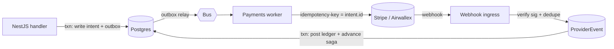
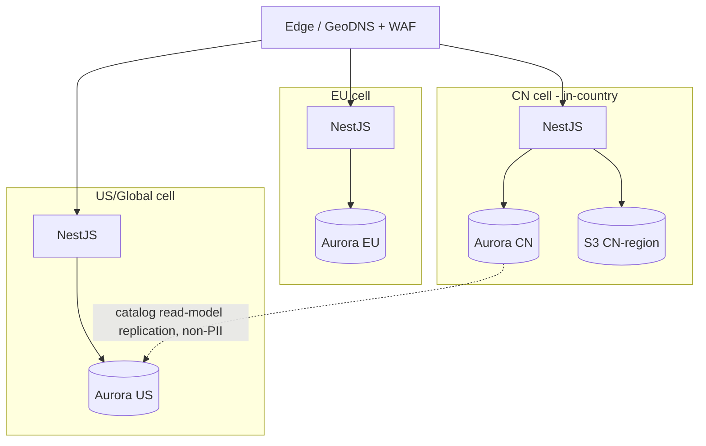

# Architecture v2

> Supersedes the money-path, residency, replica-routing, and outbox claims in `docs/ARCHITECTURE.md`.
> Fixes findings **#2** (provider-in-txn), **#4** (partitioning), **#9/#10** (residency, PII), **#12**
> (webhook ingestion), **#23** (timers), and the "read-replica routing is unhookable" / "CDC-free
> contradiction" nits. Everything here is a *mechanism*, not a slogan.

## 1. Money path = orchestrated saga, not in-line calls (fixes #2)

The v1 diagram implied services call Stripe/Airwallex synchronously inside request handlers. v2 makes
money movement an explicit asynchronous saga so no PSP call ever happens inside a DB transaction.

- **Request path** only ever writes *state + outbox* (fast, no external latency held in a txn).
- **Payments worker** consumes the outbox event and calls the PSP with `EscrowIntent.id` as the idempotency key.
- **Webhook ingress** verifies signature, dedupes into `ProviderEvent`, then a second txn posts the balanced ledger entry and advances the escrow state machine.
- Crash-safe at every hop (`ESCROW-v2.md` §1). PSP connections are **never** held by a DB transaction → no pool exhaustion under load.

## 2. Read/write routing — an actual mechanism (fixes "unhookable replicas")

v1 said "authz reads hit primary, discovery hits replica" with no way to enforce it. v2 introduces an
explicit **data-access policy** in the persistence layer:

- Two Prisma clients per service: `prismaPrimary` (writer) and `prismaReplica` (reader endpoint).
- A `@ReadConsistency('STRONG' | 'EVENTUAL')` decorator / repository method selects the client.
- **Hard rule, lint-enforced:** anything that feeds an authorization decision, money movement, or a
  uniqueness check uses `STRONG` (primary). Discovery/list/analytics use `EVENTUAL` (replica).
- After a write, the same request reads its own writes from the primary (read-your-writes) via a
  short "stickiness" window keyed in Redis.

This makes the consistency boundary a *typed, reviewable* property instead of a hope.

## 3. Outbox: poll now, logical replication later — no contradiction (fixes "CDC-free" nit)

v1 said both "CDC-free" and "Debezium-style." v2 states the actual staged plan:

- **Stage 0–1:** transactional outbox + **partial-index poll** (`WHERE publishedAt IS NULL`) with
  `FOR UPDATE SKIP LOCKED`, multiple relay pods. Simple, good to ~thousands of events/sec.
- **Stage 2+ (hot streams):** switch the relay to **Postgres logical replication / Debezium** reading
  the WAL for the outbox table — higher throughput, lower latency, replay. The outbox *table* contract
  is unchanged, so this is a relay swap, not a schema change.

Outbox rows are retained until published + a short audit window, then **dropped by a scheduled job**
(the v1 "drop after publish" now has an owner). Partition by `createdAt` (PK includes it — fixes #4).

## 4. Scheduler workers (fixes #23)

A `ScheduledAction` table (`ESCROW-v2.md` §3) backs all timers: escrow auto-release, dispute SLAs,
quote expiry, reservation windows. A scanner worker runs `SELECT ... WHERE status='PENDING' AND
dueAt<=now() FOR UPDATE SKIP LOCKED`, fires the action via the saga, marks `DONE`. Timers are durable
data, survive restarts, and are cancellable (e.g. a dispute cancels auto-release).

## 5. Data residency = physical topology, not a column (fixes #10)

`region` now drives **where data physically lives and which stack serves it**, not just a filter.

- Each **cell** is a full stack pinned to a jurisdiction; PII-bearing tables for a `region` live only in
  that cell's database and object store (PIPL/CSL for CN, GDPR for EU).
- Only the **non-PII global catalog read model** (product names, prices, supplier display data) is
  cross-replicated for global discovery. KYC docs, messages, addresses, bank refs **never** leave their cell.
- A user/company has a `homeRegion`; cross-cell references use **opaque IDs + cell routing**, never a
  cross-region FK on one cluster (which v1 would have produced). This is the seam #10 said v1 lacked.
- v1→v2 migration path: ship single-cell (GLOBAL) first; the cell abstraction + `homeRegion` make adding
  CN/EU cells an infra-and-routing task, not a schema redesign.

## 6. Webhook ingress hardening (fixes #12)

Dedicated ingress per provider: TLS, **signature verification** (Stripe-Signature / Airwallex HMAC),
timestamp/replay window, allow-listed source IPs at WAF, then idempotent landing into `ProviderEvent`
(`@@unique([provider, providerEventId])`). Processing is decoupled (queue) so a webhook storm can't
overwhelm the request tier, and a poison event lands in a DLQ with alerting.

## 7. Safety controls

- **Payout kill-switch:** a global flag the reconciliation job (or on-call) can set to halt all releases/
  payouts instantly if ledger drift, PSP-balance mismatch, or a fraud spike is detected.
- **Per-currency circuit breakers** on FX volatility beyond a threshold.
- **Blast-radius isolation:** Payments and KYC run as the first-extracted services (regulatory + PCI/PII
  isolation) with their own IAM roles, secrets, and audit stream.

## 8. Updated bounded-context invariants (deltas from v1)

| Context | New invariant |
|---------|---------------|
| Payments | No PSP call inside a DB txn; every money state change is backed by a balanced journal entry referencing a unique `ProviderEvent` |
| Messaging | A conversation is private to one (buyer, supplier) pair per RFQ |
| Identity | A person may hold roles in many companies (`Membership`); no single `companyId` on `User` |
| Residency | PII for a `region` is physically confined to that region's cell |
| Reliability | Every partitioned table's PK contains `createdAt`; outbox has a partial index + retention job |

Cross-references: `DATA-MODEL-v2.md` (schema), `LEDGER-v2.md` + `ESCROW-v2.md` (money), `COMPLIANCE-v2.md` (residency/retention/erasure/tax).
