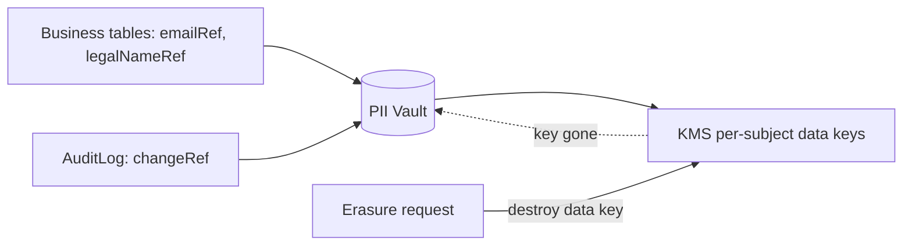

# Compliance Design v2

> Fixes findings **#6** (cascade deletes through retained records), **#9** (immutable PII audit vs.
> erasure), **#10** (`region` ≠ residency), **#11/#16** (tax/fapiao/VAT, sanctions retention).
> Compliance is now *built into the data layer and topology*, not asserted in prose.

## 1. PII vault + tokenization (fixes #9 — the audit/erasure contradiction)

The core move: **raw PII is never stored in business or audit tables.** It lives in a dedicated,
encrypted **PII Vault**, and every other table holds an opaque **token reference**.

```prisma
model PiiRecord {
  token       String   @id @db.Char(26)      // referenced everywhere as *Ref (emailRef, legalNameRef, bankRef...)
  subjectId   String   @db.Char(26)          // the data subject (user/company) this PII belongs to
  region      Region                          // residency of this PII (fixes #10)
  ciphertext  Bytes                            // envelope-encrypted value
  dataKeyId   String                           // per-subject KMS data key id
  fieldType   String                           // EMAIL | LEGAL_NAME | BANK | NATIONAL_ID ...
  createdAt   DateTime @default(now())
  shreddedAt  DateTime?                         // set on erasure
  @@index([subjectId])
}
```

- **Read PII** = resolve `*Ref` → vault → KMS-decrypt, all **authorized + audited**.
- **Right to erasure (GDPR Art.17 / PIPL)** = **crypto-shred**: destroy the per-subject KMS data key and
  null the ciphertext, set `shreddedAt`. Every `*Ref` across the system instantly dereferences to
  "[erased]" while **all foreign keys, ledger entries, and audit rows stay intact**. You satisfy
  erasure *without* deleting financial/audit history — resolving the v1 contradiction.
- **AuditLog** therefore holds `changeRef` + `changedKeys` (field names, non-PII), never raw before/after
  PII (`DATA-MODEL-v2.md` §8). The hash chain stays immutable; the PII it *pointed at* is shreddable.



## 2. Data residency — physical confinement (fixes #10)

`region` is a **placement** attribute (see `ARCHITECTURE-v2.md` §5):

- PII vault, KYC documents, messages, addresses, and bank refs for a region live **only in that
  region's cell** (Aurora + S3 in-jurisdiction). CN data stays in China (PIPL/CSL); EU in the EU (GDPR).
- The **global catalog read model** (non-PII: product, price, supplier display, reputation score) is the
  *only* thing cross-replicated, enabling worldwide discovery without exporting regulated data.
- Cross-cell links are opaque IDs resolved via cell routing — **no cross-region FK on a single cluster.**
- A subject's `homeRegion`/`Company.region` pins their cell; transfers between cells require an explicit,
  logged, consent-checked migration (rare).

## 3. Retention schedule (fixes #6 — deletes must respect retention)

| Data class | Min retention | Basis | Deletion mechanism |
|------------|---------------|-------|--------------------|
| Ledger / JournalEntry / Payment / Payout | 7–10 yrs | financial record law / tax | **never deleted**; archived to WORM S3 |
| TaxInvoice / Fapiao / VAT | per local tax law (CN: ≥5–10 yr) | tax authority | never deleted |
| KYB / KYC / SanctionsCheck | 5 yr after relationship ends | AML/KYC regs | crypto-shred PII at end of window; keep decision metadata |
| AuditLog | 7 yr (security/financial actions longer) | compliance/forensics | immutable; cold partitions → S3 Object Lock |
| Contracts | life of contract + 6–7 yr | contract law | retained; PII shreddable |
| Messages | platform policy (e.g. 3 yr) + dispute hold | evidence | PII shred on erasure; body retained if dispute evidence |
| Marketing/analytics PII | until consent withdrawn | GDPR/PIPL consent | crypto-shred |

**No `onDelete: Cascade`** touches any row in the "never deleted" classes (`DATA-MODEL-v2.md` §9). A
delete that would orphan or destroy a retained record is rejected by `onDelete: Restrict` at the DB.

## 4. Legal hold

```prisma
model LegalHold {
  id        String   @id @db.Char(26)
  scopeType String                              // ORDER | COMPANY | USER | DISPUTE
  scopeId   String   @db.Char(26)
  reason    String
  placedBy  String   @db.Char(26)
  placedAt  DateTime @default(now())
  releasedAt DateTime?
  @@index([scopeType, scopeId])
}
```

While a `LegalHold` is active on a scope, **erasure and retention-expiry deletion are suppressed** for all
data under it (litigation/regulatory hold). The crypto-shred and partition-archival jobs check for active
holds before acting.

## 5. KYC / KYB / AML retention & screening (fixes #16 "sanctions has no entity")

- `SanctionsCheck` (`DATA-MODEL-v2.md` §2) is an **auditable, retained** record with provider, result,
  match data, and expiry — what an auditor/regulator requires, which v1's free-text `FraudSignal` could not provide.
- Screening is mandatory at: company onboarding, payout-account creation, and **before every payout**
  (re-screen if `expiresAt` passed). A `HIT`/`POTENTIAL` blocks payout and opens a manual case.
- KYB decision *metadata* (who/when/risk score) is retained even after subject PII is shredded, so the
  decision remains defensible without retaining the underlying PII past its window.

## 6. Tax & invoicing (fixes #16 — fapiao/VAT gap)

- `TaxInvoice` models **fapiao (发票)**, VAT, and commercial invoices, linked to the order, with tax
  amount broken out (`DATA-MODEL-v2.md` §6). Cross-border B2B requires correct VAT/GST treatment and, for
  China-side sellers, fapiao issuance — neither was representable in v1.
- Tax is a separate line in the order total (`Order.taxTotal`) and a distinct ledger posting (tax payable
  account), never folded into price — so tax reporting and remittance are exact.
- Jurisdiction-specific tax rules live in a tax-engine adapter (e.g. Avalara/local), not hard-coded.

## 7. Consent & data-subject rights

```prisma
model ConsentRecord {
  id        String   @id @db.Char(26)
  subjectId String   @db.Char(26)
  purpose   String                              // MARKETING | PROFILING | DATA_SHARING ...
  granted   Boolean
  region    Region
  capturedAt DateTime @default(now())
  source    String                              // where/how consent was captured
  @@index([subjectId, purpose])
}
```

- **Access/portability:** export a subject's data by resolving their `*Ref` tokens + related records (per cell).
- **Erasure:** crypto-shred (above), suppressed under legal hold, audit-logged.
- **Rectification:** new vault version; audit records the change keys (not the PII).
- **Objection/restriction:** consent flags gate processing (marketing, profiling/fraud-ML on PII).

## 8. OWASP / security cross-refs

Encryption, MFA/step-up (WebAuthn for money — SMS disallowed there), secure uploads, signed document
access, secrets management, and the hash-chained audit remain as in `docs/SECURITY.md`, now reinforced by:
- PII never in logs/audit bodies (tokens only);
- payout gated on fresh sanctions screening + verified `PayoutAccount`;
- residency-aware access (a request served by the wrong cell cannot reach another region's PII).

## 9. Compliance invariants (assert in tests + audits)

1. No business or audit table stores raw PII — only `*Ref` tokens.
2. Erasure destroys the key, never a financial/audit row.
3. No `Cascade` path reaches a retained-class table.
4. Every payout is preceded by a non-expired `SanctionsCheck` and a verified `PayoutAccount`.
5. PII for region R is physically resident only in cell R.
6. Active `LegalHold` blocks erasure and retention-deletion within scope.
7. Every fapiao/VAT obligation has a `TaxInvoice` row and a matching tax ledger posting.

Cross-references: `ARCHITECTURE-v2.md` (cells/topology), `DATA-MODEL-v2.md` (schema, retention §9),
`LEDGER-v2.md` (immutable financial records), `ESCROW-v2.md` (payout gating).
