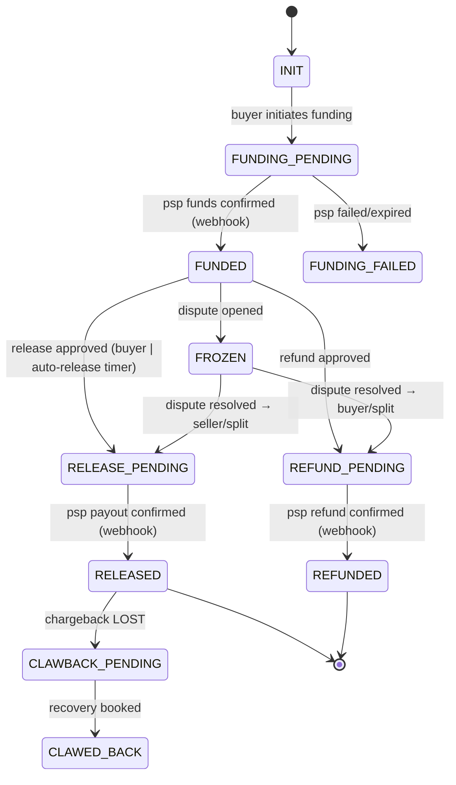

# Escrow Design v2

> Fixes findings **#1** (double-release race), **#2** (provider call inside DB txn / dual-write),
> **#11** (refund/chargeback/reserve, FX), **#23** (auto-release timer had no schema backing).
> Escrow is now an **idempotent saga / state machine**, money movement is orchestrated *outside*
> the DB transaction, and concurrent transitions are impossible by construction.

## 1. Core principle: never call the PSP inside a DB transaction (fixes #2)

v1 did `provider.releaseEscrow()` *inside* `prisma.$transaction`. v2 splits every money movement into **intent → provider call → confirmation**, each a separate, idempotent step. The DB transaction only ever writes *state + outbox*; the network call to Stripe/Airwallex happens in a worker between transactions and is reconciled by webhook.

```
[txn 1]  record intent (PENDING)  + outbox "do.release"      COMMIT
[worker] call PSP (idempotency key = intent.id)              (no DB txn held)
[webhook] PSP confirms  → ProviderEvent → [txn 2] post ledger + advance state  COMMIT
```

A crash anywhere is recoverable: the intent is `PENDING`, the worker retries with the same idempotency key (PSP dedupes), and the webhook is idempotent (`LEDGER-v2.md` §4).

## 2. State machine



Allowed transitions are a hard table; any other transition is rejected. `FROZEN` blocks release (fixes the dispute-freeze invariant) and `RELEASE_PENDING`/`REFUND_PENDING` are terminal-until-confirmed (no second action can start).

## 3. Schema (replaces v1 `EscrowAccount`)

```prisma
enum EscrowState {
  INIT FUNDING_PENDING FUNDED FUNDING_FAILED
  RELEASE_PENDING RELEASED REFUND_PENDING REFUNDED
  FROZEN CLAWBACK_PENDING CLAWED_BACK
}

model Escrow {
  id          String      @id @db.Char(26)
  orderId     String      @unique @db.Char(26)
  state       EscrowState @default(INIT)
  currency    String      @db.Char(3)
  amount      BigInt                                   // funded amount (minor units); balances live in the ledger
  provider    String
  version     Int         @default(0)                 // OPTIMISTIC LOCK (fixes #1)
  autoReleaseAt DateTime?                              // set on FUNDED+inspection-pass (fixes #23)
  frozenByDisputeId String? @db.Char(26)
  createdAt   DateTime    @default(now())
  updatedAt   DateTime    @updatedAt
  intents     EscrowIntent[]
}

model EscrowIntent {                                   // one row per money movement attempt
  id          String   @id @db.Char(26)               // == PSP idempotency key
  escrowId    String   @db.Char(26)
  escrow      Escrow   @relation(fields: [escrowId], references: [id])
  kind        String                                   // FUNDING | RELEASE | REFUND | CLAWBACK
  amount      BigInt
  currency    String   @db.Char(3)
  status      String   @default("PENDING")             // PENDING | CONFIRMED | FAILED
  providerRef String?  @unique                         // PSP object id once known
  createdAt   DateTime @default(now())
  confirmedAt DateTime?

  // AT MOST ONE in-flight money movement of a kind per escrow (fixes #1 double-release):
  @@unique([escrowId, kind, status])                   // partial-unique in SQL: WHERE status='PENDING'
}

model ScheduledAction {                                // backs auto-release & SLA timers (fixes #23)
  id        String   @id @db.Char(26)
  dueAt     DateTime
  kind      String                                     // ESCROW_AUTO_RELEASE | DISPUTE_SLA | QUOTE_EXPIRY
  refType   String
  refId     String   @db.Char(26)
  status    String   @default("PENDING")               // PENDING | DONE | CANCELLED
  createdAt DateTime @default(now())
  @@index([status, dueAt])                             // scanner: WHERE status='PENDING' AND dueAt<=now()
}
```

SQL partial-unique that actually enforces "one pending movement of a kind":

```sql
CREATE UNIQUE INDEX escrow_one_pending_per_kind
  ON "EscrowIntent" ("escrowId", kind) WHERE status = 'PENDING';
```

## 4. Double-release prevention — three independent walls (fixes #1)

1. **Optimistic lock:** the state transition is `UPDATE "Escrow" SET state='RELEASE_PENDING', version=version+1 WHERE id=? AND version=? AND state='FUNDED'`. Two racers: one updates 1 row, the loser updates 0 rows → rejected.
2. **Partial-unique intent:** only one `PENDING` `RELEASE` intent can exist per escrow (index above). Loser hits a unique violation.
3. **PSP idempotency key** = `EscrowIntent.id`: even if both somehow call the provider, Stripe/Airwallex dedupe on the key and move money once.

Any one wall suffices; all three are cheap. The v1 design had **zero**.

## 5. Release flow (the corrected version of the v1 example)

```ts
async approveRelease(orderId: string, actor: Principal, reason: 'BUYER'|'AUTO'|'DISPUTE') {
  // -------- txn 1: state transition + intent + outbox (NO provider call) --------
  const intent = await this.prisma.$transaction(async (tx) => {
    const esc = await tx.escrow.findUniqueOrThrow({ where: { orderId } });
    if (reason === 'BUYER') this.authz.assert(actor, 'order:release_escrow', { order: orderId }); // + MFA step-up upstream
    if (esc.state === 'FROZEN') throw new ConflictException('Escrow frozen by dispute');

    const moved = await tx.escrow.updateMany({                       // wall #1: optimistic + state guard
      where: { id: esc.id, version: esc.version, state: 'FUNDED' },
      data:  { state: 'RELEASE_PENDING', version: { increment: 1 } },
    });
    if (moved.count !== 1) throw new ConflictException('Escrow not releasable / concurrent change');

    const i = await tx.escrowIntent.create({                         // wall #2: partial-unique PENDING
      data: { id: ulid(), escrowId: esc.id, kind: 'RELEASE', amount: esc.amount, currency: esc.currency },
    });
    await this.outbox.emit(tx, { type: 'escrow.release.requested', aggregate: {type:'escrow', id: esc.id}, data: { intentId: i.id } });
    return i;
  });

  // -------- worker (separate, outside any DB txn): call the PSP with idempotency key --------
  // handled by the `escrow.release.requested` consumer:
}

@OnEvent('escrow.release.requested')
async doRelease(ev) {
  const intent = await this.intents.get(ev.data.intentId);
  await this.psp.createPayout({                                      // wall #3: PSP idempotency
    idempotencyKey: intent.id, amount: intent.amount, currency: intent.currency, ...
  });
  // no DB write of money here — we wait for the webhook to confirm and post the ledger
}

@OnProviderWebhook('payout.paid')                                    // idempotent (LEDGER-v2 §4)
async onPayoutPaid(evt) {
  await this.prisma.$transaction(async (tx) => {
    const pe = await this.ingestProviderEvent(tx, evt);              // unique → dedupe
    if (pe.alreadyProcessed) return;
    const intent = await tx.escrowIntent.update({ where: { id: evt.idempotencyKey },
      data: { status: 'CONFIRMED', providerRef: evt.payoutId, confirmedAt: new Date() } });
    await this.ledger.postRelease(tx, intent, evt);                  // balanced journal entry (LEDGER-v2 §3)
    await tx.escrow.update({ where: { id: intent.escrowId }, data: { state: 'RELEASED', version: { increment: 1 } } });
    await tx.order.update({ where: { id: ev.orderId }, data: { status: 'COMPLETED' } });
    await this.outbox.emit(tx, { type: 'payment.released', aggregate: {type:'order', id: ev.orderId}, data: {} });
  });
}
```

## 6. Auto-release & SLA timers (fixes #23)

On inspection pass, set `escrow.autoReleaseAt = now + 72h` **and** insert a `ScheduledAction(kind=ESCROW_AUTO_RELEASE, dueAt=...)`. A scanner worker (`WHERE status='PENDING' AND dueAt<=now() FOR UPDATE SKIP LOCKED`) fires `approveRelease(..., 'AUTO')`. The buyer can still open a dispute before `dueAt`, which cancels the scheduled action and freezes the escrow. The timer is now **data**, not a hand-wave.

## 7. Refunds, chargebacks, reserves

- **Refund** mirrors release with `kind=REFUND` (money returns to buyer; `escrow.held` → `cash.provider`).
- **Reserve**: each release also funds `reserve.chargeback` (a % held), released after the chargeback window — plain journal entries.
- **Chargeback LOST after release** → `CLAWBACK_PENDING`: clawback intent + ledger entry against `reserve.chargeback`/`loss.chargeback` and a receivable on the seller (`LEDGER-v2.md` §5). The platform's net exposure is always an explicit, queryable balance.

## 8. Invariants (assert in tests + reconciliation)

- An escrow has **at most one** `PENDING` intent per kind at any time.
- `RELEASED`/`REFUNDED`/`CLAWED_BACK` are reached **only** via a confirmed `ProviderEvent`.
- `FROZEN` ⇒ no `RELEASE_PENDING` may be created.
- Sum of `escrow.held` per buyer in the ledger ≥ 0 and equals funded-minus-released; never negative.
- No money state changes without a balanced journal entry referencing a unique provider event.

See `LEDGER-v2.md` for the journal mechanics and `COMPLIANCE-v2.md` for payout/KYC gating of releases.
