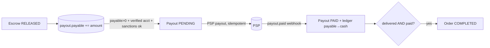

# v3 — P0 Closure

> Scope: fix **every P0** from the rejection review. P1/P2 are explicitly **left open** and listed at
> the end as a tracked backlog. Each P0 below gives: **current failure → invariant → new design →
> tradeoffs → residual risk.** Schema/SQL/state-machine deltas are concrete; v2 stays as history.

Two P0s (P0-5 ledger scale, P0-9 balance-truth) share one mechanism (immutable lines + sharded rollups);
three (P0-2, P0-3, P0-4) reshape one escrow state machine, consolidated at the end.

---

## P0-1 — Cross-border transaction vs. residency

**Current failure.** A CN factory ↔ EU trader order, its conversation, and its contract physically contain
*both* parties' personal data. Cell-per-region forces that shared record into one jurisdiction → the other
side's PII crosses a residency boundary with no legal basis. The platform's only transaction is illegal by construction.

**Invariant.** *Personal data is processed/stored only where it has a lawful basis. No personal data crosses a
residency boundary except (a) minimized business-contact data necessary to perform the B2B contract, under a
documented transfer basis + consent; sensitive personal data (national ID, personal bank, KYC docs) never crosses.*

**New design — separate PII residency from transaction residency.**
- **Three data classes:** (1) *Sensitive PII* (national ID, personal bank, KYC docs) — stays in the subject's
  **home cell** vault, used only by that cell's KYC/payout. Never crosses. (2) *Business-contact data*
  (company legal/display name, business email/phone, role) — B2B "business-card" data, shareable cross-border
  under contract-necessity (GDPR 6(1)(b)) + PIPL Standard Contract + explicit onboarding consent. (3)
  *Transaction records* (Order, Escrow, Ledger, Contract, Messages) — hold **only tokenized `*Ref` pointers**,
  no raw PII.
- **Neutral transaction cell.** Shared bi-regional records (order/contract/conversation) live in a designated
  **home cell per transaction** (deterministic: buyer's region, recorded on the record), storing tokens only.
  Rendering a counterparty's *business-contact* data resolves the token cross-cell **through a class-2 gate**
  (lawful basis + minimization); class-1 tokens **refuse** cross-cell resolution.
- **Legal scaffolding (not just tech):** PIPL Standard Contract filing for CN↔world business data; SCCs for
  EU; consent captured in `ConsentRecord(purpose=CROSS_BORDER_COUNTERPARTY)`; a `DataTransfer` audit record
  per cross-cell PII resolution.

```prisma
model DataTransfer {            // every cross-cell PII resolution is logged + basis-checked
  id          String   @id @db.Char(26)
  subjectRef  String                       // token resolved
  dataClass   Int                          // 2 only; class 1 is non-resolvable cross-cell
  fromCell    Region
  toCell      Region
  basis       String                       // CONTRACT_NECESSITY | CONSENT | SCC | PIPL_SC
  viewerId    String   @db.Char(26)
  createdAt   DateTime @default(now())
  @@index([subjectRef])
}
```

**Tradeoffs.** Real legal overhead (SCC/PIPL filings, consent capture); cross-cell token resolution adds latency
and a gate on every counterparty render; rich personal data of a counterparty is simply unavailable cross-border
(only business-card fields show). Some convenience features die.

**Residual risk.** Free-text fields (messages, product descriptions, spec PDFs) can still carry personal data
that crosses — **only DLP/classification (P1-12) fully closes this**; until then the transfer basis is the
backstop, not a guarantee. PIPL Standard Contract approval is a regulatory dependency outside our control; a
hostile DPA could still challenge contract-necessity. This P0 is *de-risked*, not *eliminated* — it is now a
documented, defensible posture instead of a silent violation.

---

## P0-2 — Chargeback while escrow is FUNDED

**Current failure.** `CLAWBACK_PENDING` was reachable only from `RELEASED`. A chargeback on the *funding* while
state is `FUNDED` is unhandled → auto/ops release fires → seller paid → card network pulls funding back → double loss, on demand.

**Invariant.** *No escrow may move toward release while any open chargeback or inquiry exists against its funding;
a funding dispute immediately freezes the escrow and cancels any pending release.*

**New design.**
- New freeze reason + transitions: `FUNDED --funding dispute/inquiry--> FROZEN(reason=FUNDING_DISPUTE)`. The PSP
  dispute/inquiry webhook (`charge.dispute.created`, inquiry) **freezes** and **cancels the auto-release
  `ScheduledAction`**.
- Release guard hardened: a release transition asserts `NOT EXISTS (open Chargeback WHERE paymentId =
  escrow.fundingPaymentId)`. Belt to the state belt.
- Pre-release loss is now impossible because the money is **still in escrow**: on funding chargeback **LOST**,
  new transition `FROZEN(FUNDING_DISPUTE) --> FUNDING_REVERSED` returns the held funds to the network from
  escrow (no payout ever happened) → **zero platform loss**. On **WON**, `FROZEN --> FUNDED` (unfreeze) and
  re-arm auto-release.
- **Settlement-risk hold:** escrow funds are not eligible for auto-release until funding has *settled past the
  card inquiry window* (configurable, e.g. T+N days), shrinking the race in P0-7's residual.

**Tradeoffs.** Legitimate releases are delayed by spurious inquiries and by the settlement hold; more states and a
full mapping of the PSP dispute lifecycle (inquiry → chargeback → representment → win/loss) is required.

**Residual risk.** A microsecond race where release confirmed *just before* the freeze webhook still exists —
covered by the settlement hold (don't release until past the highest-risk window) and, for post-release late
chargebacks, by the reserve/clawback path (already P0). Network-initiated disputes that bypass webhooks (rare)
need the reconciliation sweep to catch.

---

## P0-3 — Split dispute resolution unimplementable

**Current failure.** From `FROZEN` the machine allowed `RELEASE_PENDING` **or** `REFUND_PENDING` — one only.
`RESOLVED_SPLIT` (e.g. 60% seller / 40% buyer) needs both legs; `Escrow.amount` was a single scalar.

**Invariant.** *A dispute resolution is one atomic settlement that partitions the held amount across {seller payout,
buyer refund, platform} summing exactly to the held amount; the escrow is SETTLED only when every leg is confirmed.*

**New design.**
- Replace the single release/refund-from-FROZEN with an **`EscrowSettlement`** that carries multiple legs and is
  validated `Σ legs == heldAmount` (per currency) before execution.
- States: `FROZEN --> SETTLING --> SETTLED` (and `SETTLING --> SETTLE_PARTIAL` if one leg fails → ops/compensation).
- Each leg spawns its own `EscrowIntent` (`kind=RELEASE` payout leg, `kind=REFUND` buyer leg) with independent PSP
  idempotency; `SETTLED` is reached only when **all** legs are confirmed by webhook.
- Ledger: one balanced settlement journal entry — `escrow.held → payout.payable(seller) + refund→buyer +
  platform.fees`, balanced per currency (FX legs if buyer/seller currencies differ).

```prisma
model EscrowSettlement {
  id          String   @id @db.Char(26)
  escrowId    String   @db.Char(26)
  disputeId   String?  @db.Char(26)
  sellerAmount BigInt  @default(0)
  buyerAmount  BigInt  @default(0)
  feeAmount    BigInt  @default(0)
  currency     String  @db.Char(3)
  status       String  @default("PENDING")   // PENDING | EXECUTING | COMPLETE | PARTIAL
  createdAt    DateTime @default(now())
  // CHECK: sellerAmount + buyerAmount + feeAmount = escrow.heldAmount  (trigger)
}
```

**Tradeoffs.** Two PSP calls per split; an intermediate `SETTLE_PARTIAL` state when one leg confirms and the other
fails, requiring compensation/ops; cross-currency splits multiply FX edges and rounding points.

**Residual risk.** Partial-settlement (payout paid, refund failed) needs a deterministic compensation path; if the
buyer's refund instrument is dead, the buyer-leg may convert to credit/manual handling. These are ops-recoverable,
not money-loss, but they add operational surface.

---

## P0-4 — Payout lifecycle disconnected from escrow

**Current failure.** The saga called `psp.createPayout` *during release* and jumped to `RELEASED/COMPLETED`,
never creating a `Payout` row or touching `payout.payable`. "Released" was conflated with "seller's bank received funds."

**Invariant.** *Release credits the seller's payable balance only; a separate, independently tracked `Payout`
disburses that balance to a verified account; "released" never implies "paid"; an order is `COMPLETED` only when
goods are delivered **and** the payable is settled.*

**New design — explicit two steps.**
- **Step A (release):** `FUNDED/SETTLING → RELEASED` books `escrow.held → payout.payable(seller)` (minus fee +
  reserve). No bank movement, no order completion.
- **Step B (payout):** a `Payout` (PENDING) is created when `payout.payable(seller) > 0` **and** a `verified
  PayoutAccount` + non-expired `SanctionsCheck` exist. Payout worker calls the PSP (idempotent, P0-7); on
  `payout.paid` webhook → `Payout=PAID`, ledger `payout.payable → cash.provider`. Enables **batched payouts**
  (sweep many orders' payables into one disbursement).
- **Order completion rule (cross-aggregate):** `Order.status=COMPLETED` requires `Shipment.delivered` **and**
  `payout settled`. Decouples the three lifecycles with an explicit join condition.



**Tradeoffs.** More entities and steps; sellers see "released" before "paid" (UX/comms needed); payout batching
adds its own reconciliation.

**Residual risk.** Payable can accumulate if payouts repeatedly fail (dead bank account) — needs dunning + a
per-seller payable exposure policy (**P1-5/P1-11 territory**). The `delivered` signal depends on shipment data
accuracy; a missing delivery event could strand an order short of `COMPLETED` (ops-recoverable).

---

## P0-5 — Ledger doesn't scale to 100M orders + hot-account contention

**Current failure.** `JournalLine/JournalEntry/Account/AccountBalance/Escrow` were "keep on primary," PK = `id`
only → not partition-ready (600M+ `JournalLine` rows on one writer). `platform.revenue.fees` and `fx.position.*`
took an `AccountBalance` UPDATE on every order → lock convoy on a handful of rows; optimistic `version` → retry storm.

**Invariant.** *(a) Financial tables are partition-ready and horizontally scalable; (b) no single balance row is
the target of high-frequency writes; (c) any balance is reconstructable from immutable lines at any time.*

**New design.**
- **Partition-ready PKs:** `JournalEntry` PK `(id, effectiveAt)`, `JournalLine` PK `(id, createdAt)`, range-partition
  by month; idempotency unique becomes `@@unique([sourceType, sourceId, effectiveAt])`. Shard by money domain /
  order-region at Stage 3 (Citus) — partition keys already present.
- **Kill the hot-row balance.** Remove the mutable per-account `AccountBalance` from the write path. The write path
  inserts **immutable lines only** (no balance UPDATE → no hot-row lock). Balances become **sharded rollups**:

```prisma
model AccountRollup {                 // periodic, idempotent fold of immutable lines
  accountId   String   @db.Char(26)
  currency    String   @db.Char(3)
  shard       Int                      // hot accounts use N shards; cold use 0
  balance     BigInt   @default(0)
  watermark   DateTime                 // lines up to here are folded in
  @@id([accountId, currency, shard])
}
```
  - **Hot accounts** (platform revenue, fx position, reserve): each line write picks a random `shard ∈ [0,N)`
    (write spread across N rows / N partitions → no contention). True balance = `Σ shards`.
    Cold accounts use shard 0.
  - A rollup job folds new immutable lines per partition into `AccountRollup` and advances `watermark`. Reads =
    `Σ rollup + Σ lines since watermark`.

**Tradeoffs.** Balance reads now sum shards (+ tail of lines) → mildly more complex and *eventually consistent* for
hot accounts; rollup/bucketing machinery and partition ops are new critical-path infrastructure.

**Residual risk.** Hot-account balances are eventually consistent (rollup lag) — **must never gate authorization or
limits without a strong read** (sum lines on primary, costed). Rollup-watermark correctness is now safety-critical
(guarded by the P0-9 invariant check). Very large `N` shard fan-out has read cost; tune N per account.

---

## P0-6 — Active company unbound + ABAC references a deleted field

**Current failure.** v2 replaced `User.companyId` with `Membership`, but `API.md` ABAC still reads
`principal.companyId` (gone), and nothing pins *which* company a request acts as. A multi-company user could pass a
`companyId` the server trusts → v1's client-supplied-identity bug reborn, plus **self-dealing** (one user as both sides).

**Invariant.** *Every authenticated request carries exactly one server-validated active membership; all authz and
row-scoping use that membership's `companyId`, verified against the user's `Membership` rows; a user may not act as
two companies in one operation, nor be both sides of a transaction.*

**New design.**
- **Active membership in the validated session.** The token/session carries `activeMembershipId`. On every request
  the server resolves the principal as `{ userId, activeMembershipId, companyId, roles }` from `Membership`
  (status=ACTIVE) — **never from the request body**. Switching company is an explicit, re-authenticated action that
  re-issues the token and **drops any MFA step-up context**.
- **Rewrite all ABAC predicates** to the active company:
  - `order:read` ⇒ `principal.companyId ∈ {order.buyerCompanyId, order.sellerCompanyId}` ∨ platform admin.
  - `product:update` ⇒ `product.manufacturer.companyId == principal.companyId`.
  - resource rule: every scoped resource carries `companyId`; access requires equality with `principal.companyId`
    or an explicit counterparty grant.
- **Self-dealing guard.** Order/quote/dispute mutations assert `buyerCompanyId != sellerCompanyId` and that the
  actor's active company is exactly one side; same-actor-both-sides is rejected.

```ts
// resolved server-side every request; request body NEVER supplies companyId
interface Principal { userId: string; activeMembershipId: string; companyId: string; roles: string[]; }
function assertScope(p: Principal, resourceCompanyId: string) {
  if (p.companyId !== resourceCompanyId && !p.roles.includes('PLATFORM_ADMIN'))
    throw new ForbiddenException();
}
```

**Tradeoffs.** Adds an "active company" selector to UX; switching re-issues the token; slightly more session state;
`API.md` ABAC section must be reissued for the Membership model.

**Residual risk.** Two *distinct* companies with the same beneficial owner can still collude (buyer + seller fronts)
— that's a UBO-graph/fraud problem (**P1-8 / UBO**), not solvable by request-scoping. Token theft still impersonates
one membership (mitigated by MFA/step-up on money actions).

---

## P0-7 — PSP idempotency key reuse beyond TTL → duplicate payout

**Current failure.** PSP idempotency key = `EscrowIntent.id`. Stripe keys expire (~24h). A retry after the window
reuses a forgotten key → the PSP creates a **second payout**.

**Invariant.** *A money movement is disbursed at most once, verified against the PSP's own record of truth,
independent of idempotency-key TTL.*

**New design.**
- **Reconcile-before-issue.** Before any (re)issue for an intent, query the PSP for an existing object tagged with
  `metadata.intentId = intent.id` (Stripe search / list; Airwallex by `request_id`/reference). If found → **adopt
  its `providerRef`**, do not create. Create only if none exists. The PSP's ledger, not the expiring key, is the
  authority.
- Persist `providerRef` the instant it's known; treat presence of `providerRef` as "already issued."
- **Bounded retries.** The retry `ScheduledAction` has `maxAttempts`; after N, the intent goes to **manual review**
  — never a blind re-issue.
- Keep the idempotency key for in-window dedupe (cheap), but it is no longer the sole guarantee.

```ts
async function issuePayoutOnce(intent) {
  if (intent.providerRef) return intent.providerRef;                 // already issued
  const existing = await psp.findByMetadata({ intentId: intent.id }); // PSP = source of truth
  if (existing) return adopt(intent, existing.id);
  return create(intent, { idempotencyKey: intent.id, metadata: { intentId: intent.id } });
}
```

**Tradeoffs.** An extra PSP read before each (re)issue (latency + API cost); depends on PSP search/list
availability.

**Residual risk.** Stripe `search` is **eventually consistent** — a just-created object may not appear instantly,
leaving a small dup window on near-simultaneous retries. Mitigate with: a short post-create settle delay before any
retry, single-flight per intent (the partial-unique pending intent from v2), and a daily **dup-detection sweep** that
finds two PSP objects for one `intentId` and auto-reverses the extra. Window shrinks to minutes and is self-healing.

---

## P0-8 — `JournalLine.currency` not constrained to `Account.currency`

**Current failure.** A line could post USD into a CNY account; the per-entry trigger only checks balance *per
currency*, so the entry passes while the account is corrupted — a self-balancing misallocation.

**Invariant.** *Every journal line's currency equals its account's currency; account currency is immutable.*

**New design — make it a foreign key, not a hope.**
- Add `@@unique([id, currency])` to `Account`, then a **composite FK** on the line:
  `JournalLine(accountId, currency) → Account(id, currency)`. Postgres now refuses any line whose
  `(accountId, currency)` pair doesn't match the account's real currency. App-layer trust removed.
- Make `Account.currency` immutable via a trigger rejecting UPDATEs of `currency`.

```sql
ALTER TABLE "Account"     ADD CONSTRAINT account_id_ccy UNIQUE (id, currency);
ALTER TABLE "JournalLine" ADD CONSTRAINT jline_acct_ccy
  FOREIGN KEY ("accountId", currency) REFERENCES "Account"(id, currency);
-- immutable account currency:
CREATE TRIGGER account_ccy_immutable BEFORE UPDATE OF currency ON "Account"
  FOR EACH ROW EXECUTE FUNCTION reject_change();
```

**Tradeoffs.** A redundant unique index on `Account(id,currency)` and a composite FK (small storage/index cost). With
partitioning (P0-5), the FK target must include the partition key or use a non-partitioned `Account` (accounts are
few — keep `Account` unpartitioned).

**Residual risk.** Negligible. The only edge is an account-currency change, which is now structurally forbidden.

---

## P0-9 — `AccountBalance` is a second source of truth

**Current failure.** Balance was both "derived from lines" *and* stored mutably in `AccountBalance`; nothing forced
`balance == SUM(lines)` → silent drift, exactly the v1 `EscrowAccount.heldAmount` flaw relocated.

**Invariant.** *Balance is a derived value. Any materialized balance equals the sum of immutable lines for that
account up to its watermark, and this equality is continuously verified; a mismatch halts payouts.*

**New design.**
- **Immutable lines are the only truth** (append-only; UPDATE/DELETE rejected by trigger — also closes P1-1). The
  mutable in-txn balance is **deleted**; balances are the **`AccountRollup`** shards from P0-5 (deterministic,
  re-runnable folds), read as `Σ rollup + Σ lines-since-watermark`.
- **Continuous invariant check.** A job recomputes, per account/partition, `Σ lines ≤ watermark` and asserts it
  equals the stored rollup. Any mismatch → **payout kill-switch** + page (drift = bug or fraud, stop moving money).
- **Strong vs. eventual reads** made explicit: limit/authorization checks that need exactness sum lines on the
  primary; dashboards/UX use rollups.

```sql
-- lines are immutable (truth); reject mutation
CREATE TRIGGER jline_immutable BEFORE UPDATE OR DELETE ON "JournalLine"
  FOR EACH ROW EXECUTE FUNCTION reject_change();
```

**Tradeoffs.** Balances are eventually consistent (rollup lag); reads are a touch more complex; strong reads cost a
line-sum on the primary.

**Residual risk.** Rollup-watermark logic is now safety-critical (guarded by the invariant check itself). A
high-frequency strong-balance read is expensive at 100M-order scale — define which decisions truly need it (few:
credit limits, exposure caps) and cache the rest.

---

## Consolidated escrow state machine (P0-2 + P0-3 + P0-4)

```mermaid
stateDiagram-v2
  [*] --> INIT
  INIT --> FUNDING_PENDING
  FUNDING_PENDING --> FUNDED: funded (webhook)
  FUNDING_PENDING --> FUNDING_FAILED
  FUNDED --> FROZEN: dispute opened OR funding chargeback/inquiry (P0-2)
  FUNDED --> RELEASED: release (buyer/auto) — only past settlement hold & no open funding dispute (P0-2)
  FUNDED --> REFUND_PENDING: full refund
  FROZEN --> FUNDING_REVERSED: funding chargeback LOST (funds still held → no platform loss) (P0-2)
  FROZEN --> FUNDED: funding dispute WON (unfreeze)
  FROZEN --> SETTLING: dispute resolved (release/refund/SPLIT) (P0-3)
  SETTLING --> SETTLED: all legs confirmed
  SETTLING --> SETTLE_PARTIAL: a leg failed → compensation/ops
  RELEASED --> [*]: credits payout.payable; Payout is a SEPARATE lifecycle (P0-4)
  REFUND_PENDING --> REFUNDED
  RELEASED --> CLAWBACK_PENDING: post-release chargeback LOST (reserve/clawback)
```

Key: **release only credits `payout.payable`** (P0-4); **FUNDED freezes on a funding dispute** and pre-release
loss is impossible because funds are still held (P0-2); **resolutions go through a multi-leg `EscrowSettlement`**
that supports splits (P0-3).

---

## Cross-cutting invariant checks (CI + runtime)

1. Σ all `JournalLine.amount` = 0 per currency, globally and per entry (P0-8 makes per-account currency exact).
2. Every `AccountRollup` shard = Σ its immutable lines ≤ watermark; mismatch ⇒ payout kill-switch (P0-9).
3. No escrow reaches `RELEASED`/`SETTLED`/`REFUNDED` without confirmed `ProviderEvent`s; no release while a
   funding dispute is open (P0-2).
4. `Σ EscrowSettlement legs == heldAmount` per currency before execution (P0-3).
5. No PSP disbursement without a prior PSP existence check when key age > TTL (P0-7).
6. Every request resolves exactly one server-validated `activeMembershipId`; no resource access where
   `resource.companyId != principal.companyId` (P0-6).
7. Class-1 PII tokens never resolve cross-cell; every class-2 cross-cell resolution has a `DataTransfer` row (P0-1).

---

## Still OPEN — P1 (fix before launch) and P2 (accepted), not addressed here

**P1:** ledger/entry immutability triggers rollout (P1-1, partly done via P0-9) · drop the contradictory
`@@unique([escrowId,kind,status])` (P1-2) · **milestone/partial release** (P1-3) · split FX residual vs spread vs
PnL accounts (P1-4) · reserve release schedule + currency + per-seller exposure cap (P1-5) · cross-aggregate
order/escrow/shipment/dispute invariants (P1-6) · fapiao via Golden Tax / marketplace deemed-supplier VAT (P1-7) ·
export-control / dual-use / end-user screening (P1-8) · cross-cell PII-resolution residency hardening (P1-9) ·
PgBouncer mode vs Prisma interactive txns (P1-10) · collapse `Payment`/`EscrowIntent`/`JournalEntry` authority
(P1-11) · catalog DLP/PII classification before global replication (P1-12).

**P2:** ULID time-ordered insert hotspot · `ProviderEvent` payload PII retention · `SampleOrder` escrow wiring ·
OpenSearch per-locale sizing/cost.

These are tracked, not silently closed. P0-1 and P0-5 are *de-risked to a defensible posture*, not perfected —
their residual risks (cross-border free-text PII; eventual-consistent hot balances) are explicitly owned above.
